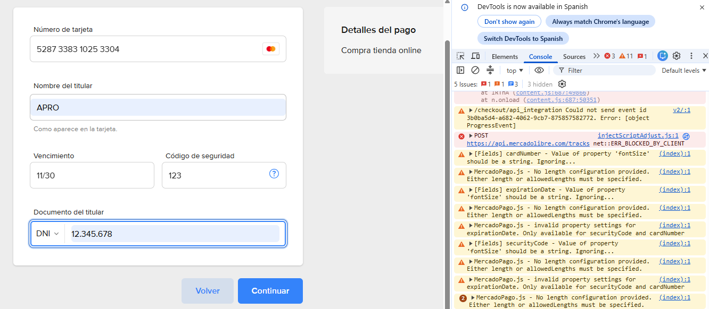
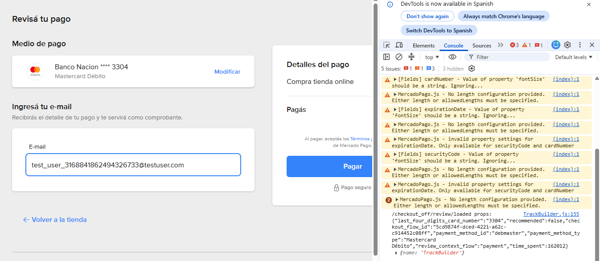
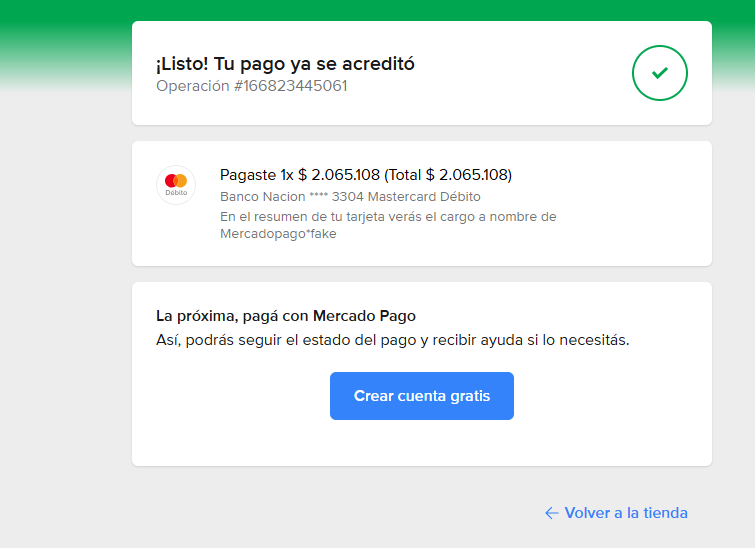

# Mi Tienda React - TP Entrega Final

Esta entrega final se encuentra en un repositorio nuevo porque incorpora funcionalidades adicionales (autenticación, CRUD, carrito e integración con Mercado Pago), por lo que se presenta como un proyecto independiente de la primera entrega.

---

> ## ⚠️ IMPORTANTE — Instrucciones para probar el pago
>
> El sistema de pagos usa **Mercado Pago en modo sandbox** (pruebas).
> Para probar el checkout es obligatorio usar **tarjetas de prueba** — no tarjetas reales.
>
> 📄 **Ver archivo: `INSTRUCCIONES_TARJETAS.txt`** en la raíz del proyecto.
> Contiene las tarjetas de prueba, los estados simulados por nombre de titular y el flujo completo de prueba paso a paso.

---

## Demo en vivo

| Recurso | URL |
|---|---|
| Repositorio |

 https://github.com/nestdanchia/mercadopago-carrito-react |

| Frontend (Vercel) | https://mercadopago-carrito-react.vercel.app |

| Backend (Render) | https://mercadopago-carrito-react.onrender.com |

**Credenciales de administrador:** fueron enviadas al docente.


## Valores de prueba requeridos por Mercado Pago

Importante: Las siguientes capturas muestran los valores de prueba proporcionados por Mercado Pago para el entorno Sandbox. Estos datos deben ingresarse exactamente como se indican. Si se utilizan valores distintos (por ejemplo, una tarjeta o un nombre de titular no válidos para pruebas), Mercado Pago puede mostrar una página de error (/fatal) y el flujo de pago no regresará a la aplicación.


<h3>1. Completar los datos de la tarjeta de prueba</h3>
<p align="center">
  
</p>

<h3>2. Confirmar el pago</h3>
<p align="center">
  
</p>

<h3>3. Resultado de la operación</h3>
<p align="center">
  
</p>


## Pruebas con Mercado Pago

Las instrucciones completas para realizar las pruebas del checkout se encuentran en:

📄 **[INSTRUCCIONES_TARJETAS.txt](./INSTRUCCIONES_TARJETAS.txt)**

Ver archivo: `INSTRUCCIONES_TARJETAS.txt` en la raíz del proyecto.


> El backend está en Render con plan gratuito. Si no recibe peticiones por 15 minutos se duerme. La primera solicitud al chat IA o al pago puede tardar hasta 60 segundos mientras se reactiva.

---

## Funcionalidades

- Catálogo de productos — listado con imágenes, precios y stock
- Ver detalle — página individual de cada producto
- Carrito de compras — agregar productos, ver resumen, aplicar bono de descuento
- Bono de descuento del 30% — se activa automáticamente cuando el total supera $1.000.000
- Validación de stock al finalizar la compra — evita overselling
- Autenticación — registro, login y logout con Firebase Authentication
- Recupero de contraseña — por email vía Firebase
- CRUD de productos — alta, edición y eliminación (solo administradores)
- Panel de administración — gestión de productos, visualización y eliminación de órdenes
- Promover usuarios a administrador — desde el área privada
- Chat con IA — asistente integrado para consultas sobre laptops
- Integración con Mercado Pago — sandbox con preferencias, back_urls y páginas de resultado
- Órdenes en Firestore — se crean como `"pendiente"` y se actualizan según el resultado del pago

---

## Tecnologías utilizadas

**Frontend:**
- React 19
- Vite
- React Router DOM v7
- React Icons
- Context API (carrito y autenticación)

**Backend:**
- Node.js
- Express v5
- SDK oficial de Mercado Pago v3
- dotenv / cors

**Base de datos y autenticación:**
- Firebase Authentication
- Firebase Firestore

**IA:**
- Groq API (proveedor principal — modelo llama-3.1-8b-instant)
- OpenRouter API (fallback — modelo meta-llama/llama-3.1-8b-instruct)

**Pagos:**
- Mercado Pago Checkout Pro (SDK Node.js)

**Despliegue:**
- Vercel (frontend React)
- Render (backend Node + Express)

---

## Servicios externos

| Servicio | Función |
|---|---|
| Firebase Auth | Autenticación de usuarios |
| Firestore | Base de datos de productos, órdenes y usuarios |
| Mercado Pago | Procesamiento de pagos |
| Groq | IA principal del chat |
| OpenRouter | IA fallback del chat |
| Render | Hosting del backend |
| Vercel | Hosting del frontend |

---

## Estructura del proyecto

```
TPprimerEntrega/
│
├── public/
│   ├── data/
│   │   └── productos.json          ← fallback local si Firestore falla
│   └── *.jpeg / *.png              ← imágenes de productos
│
├── src/
│   ├── components/
│   │   ├── Administrar/            ← CRUD productos, tabla órdenes, promover admin
│   │   ├── Auth/                   ← Login y Registro
│   │   ├── Carrito/                ← Carrito y CarritoItem
│   │   ├── CatalogoProductos/      ← Grilla de productos
│   │   ├── ChatIA/                 ← Asistente IA
│   │   ├── Item/                   ← Tarjeta individual de producto
│   │   ├── Layout/                 ← Header, Navbar, Footer
│   │   ├── Pago/                   ← PagoExitoso, PagoFallido, PagoPendiente
│   │   └── ProductoDetalle/        ← Vista detalle de producto
│   │
│   ├── context/
│   │   ├── auth/                   ← AuthProvider, AuthContext
│   │   └── cart/                   ← CartProvider, CartContext
│   │
│   ├── firebase/
│   │   └── config.js               ← Configuración Firebase
│   │
│   ├── services/
│   │   ├── cargaProductos.jsx      ← CRUD Firestore + fallback JSON
│   │   ├── ordenesService.js       ← Crear, validar stock y actualizar órdenes
│   │   ├── migrarDatosIniciales.js ← Seed inicial (comentado, histórico)
│   │   └── pruebaLectura.js        ← Diagnóstico de conexión al arrancar
│   │
│   ├── comentarios.txt             ← Documentación técnica del proyecto
│   ├── App.jsx
│   └── main.jsx
│
├── server.js                       ← Backend Express (IA + Mercado Pago)
├── vercel.json                     ← Configuración de rutas para Vercel (SPA)
├── package.json
├── .env                            ← Variables de entorno (no se sube a Git)
├── INSTRUCCIONES_TARJETAS.txt      ← Guía para probar el pago con MP
└── README.md
```

---

## Flujo de compra

1. El usuario navega el catálogo y agrega productos al carrito
2. Si el total supera $1.000.000 se genera un código de bono del 30%
3. Al finalizar la compra, si no está logueado se lo redirige al login
4. Se valida el stock disponible en Firestore antes de crear la orden
5. Se crea la orden en Firestore con estado `"pendiente"`
6. El backend genera una preferencia en Mercado Pago y devuelve el `init_point`
7. El usuario paga en el checkout de Mercado Pago con tarjetas de prueba
8. Al volver, `/pago-exitoso`, `/pago-fallido` o `/pago-pendiente` actualiza el estado de la orden

---

## Sistema de fallback de productos

Si Firestore no responde, la aplicación carga automáticamente `public/data/productos.json` sin mostrar ningún error al usuario. En ningún caso la app queda sin productos.

---

## Chat con IA

El asistente está disponible en `/chat`. Responde consultas sobre laptops. El backend intenta primero con Groq y si falla usa OpenRouter como respaldo automático.

---

## Correr el proyecto localmente

El profesor no necesita hacer esto. La app ya está desplegada y funciona desde el navegador.

```bash
# Instalar dependencias
npm install

# Iniciar frontend (en una terminal)
npm run dev

# Iniciar backend (en otra terminal)
npm run server
```

El archivo `.env` debe contener:

```
VITE_API_URL=http://localhost:3001
GROQ_API_KEY=...
OPENROUTER_API_KEY=...
CLIENT_URL=http://localhost:5173
MERCADOPAGO_ACCESS_TOKEN=...
VITE_FIREBASE_API_KEY=...
VITE_FIREBASE_AUTH_DOMAIN=...
VITE_FIREBASE_PROJECT_ID=...
VITE_FIREBASE_STORAGE_BUCKET=...
VITE_FIREBASE_MESSAGING_SENDER_ID=...
VITE_FIREBASE_APP_ID=...
```

---

## Integración con Mercado Pago

El token de acceso vive únicamente en el servidor (`.env`), nunca en el frontend.
Se usa el SDK oficial de Mercado Pago para Node.js (`mercadopago` v3).
El checkout está en modo sandbox con cuentas de prueba.
En producción se deben actualizar las `back_urls` con las URLs de Vercel y activar `auto_return: "approved"` en `server.js`.

---

## Aclaración sobre el repositorio

Esta es la entrega final del TP. La primera entrega está en un repositorio separado. Este proyecto la extiende con autenticación, roles, CRUD completo, validación de stock, órdenes y pago con Mercado Pago.
